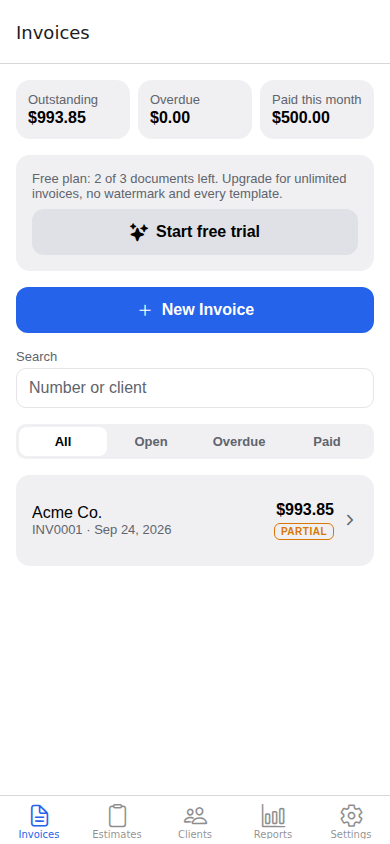
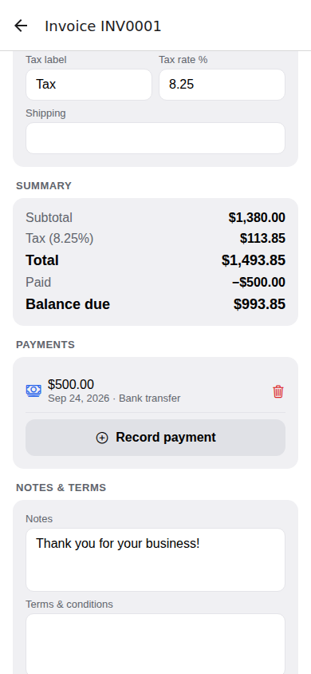
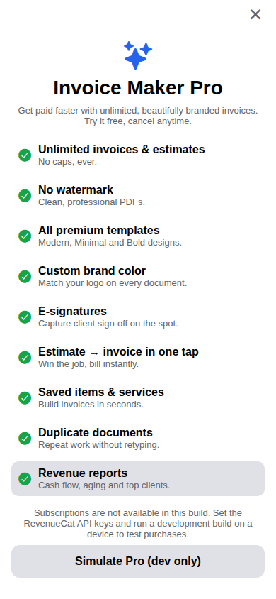
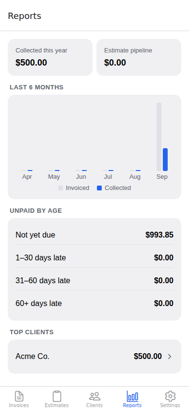
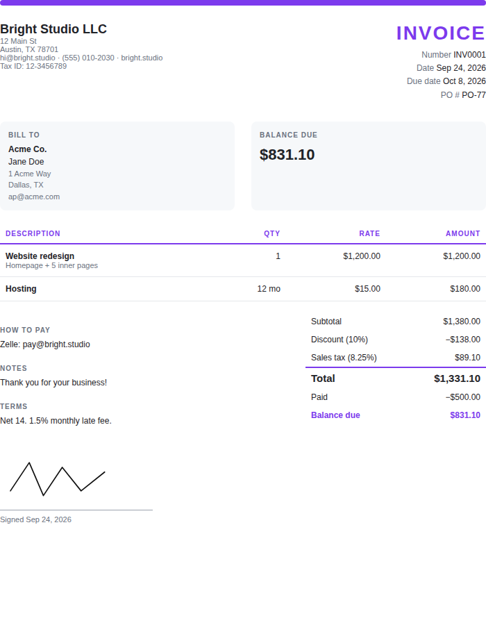
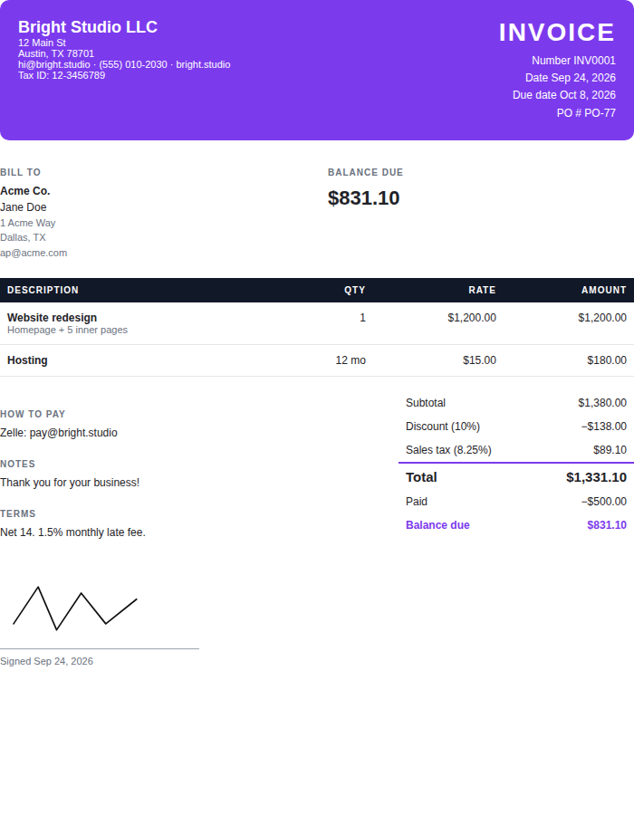

# Invoice Maker

A mobile invoice and estimate app for iOS and Android, built with Expo and React Native. Freelancers and small businesses can create, send and track invoices from their phones. The app has a free tier. A Pro subscription with a free trial unlocks everything else.

> "Invoice Maker" is a placeholder name. To rename the app, change `APP_NAME` in `src/constants/theme.ts` and the `name`, `slug`, `scheme` and bundle IDs in `app.json`.

| Invoices | Editor | Paywall | Reports |
| --- | --- | --- | --- |
|  |  |  |  |

| PDF: Modern template | PDF: Bold template |
| --- | --- |
|  |  |

## Features

- **Invoices and estimates** with line items (quantity, rate, unit, details), a percent or fixed discount, tax on taxable items only, and shipping. A test suite covers the totals math.
- **Payment tracking.** You can record partial and full payments by method. Invoice status (draft, sent, partial, paid, overdue, void) is worked out from the payments and the due date, so it can't go stale.
- **Estimates:** mark them accepted or declined, capture the client's signature, and convert one to an invoice in one tap. The two documents link to each other.
- **PDF export and sharing** through the native share sheet (Mail, Messages, WhatsApp, Files and so on), plus print preview and AirPrint.
- **Four PDF templates** (Classic, Modern, Minimal, Bold) with your logo and brand color.
- **Clients** with contact details, billing history, and totals billed and outstanding.
- **Saved items and services** that you can add to any invoice with one tap.
- **Dashboard:** outstanding, overdue and paid-this-month totals, search, and status filters.
- **Reports:** invoiced versus collected over the last 6 months, unpaid invoices grouped by how late they are, top clients, and the value of open estimates.
- **Business profile:** logo, tax ID, payment instructions, 20 currencies, and document prefixes and numbering.
- **Cloud sync and backup** across devices, with passwordless email sign-in. The app still works fully offline.
- **Email invoices from the app.** The client gets a link to view the invoice, download a PDF and **pay by card**. Payments go through Stripe Connect into your own account, and the invoice is marked paid automatically.
- **"Client viewed your invoice"** and **"Payment received"** push notifications.
- **Clients approve estimates online.** They type their name to sign, then pay the requested **deposit** right away. Invoices can also ask for a deposit, and the client chooses to pay the deposit or the full amount.
- **Job-site photos** on invoices and estimates, shown on the PDF and the client's link.
- **Withholding tax** (for example IRPF or retención).
- **Automatic late fees**, either a percentage or a flat amount, after a grace period you choose.
- **Expenses with AI receipt scanning.** Take a photo of a receipt and the vendor, date, total, tax and category are filled in. The Money tab shows income, expenses and profit.
- **AI line items.** Describe the job ("4 hrs labor at $85, heater $650…") and get clean line items, using your saved prices where they match.
- **Honest subscriptions**: no weekly plans, a reminder 2 days before the free trial ends, and "Manage subscription" in Settings.
- **Automatic payment reminders** before the due date, on it, and every N days after, sent during the client's business hours.
- **Recurring invoices** (weekly to yearly), which can be emailed to the client automatically.
- Dark mode.

## Free vs Pro

| | Free | Pro |
| --- | --- | --- |
| Invoices and estimates | 3 per month | Unlimited |
| PDF watermark | Yes | No |
| Templates | Classic | All 4 |
| Brand color | Default | Custom |
| Payments, clients, logo, PDF sharing | ✓ | ✓ |
| E-signatures | | ✓ |
| Estimate → invoice conversion | | ✓ |
| Saved items catalog | | ✓ |
| Duplicate documents | | ✓ |
| Reports | | ✓ |
| Cloud sync and backup | | ✓ |
| Email invoices, hosted link, online card payments | | ✓ |
| Automatic reminders | | ✓ |
| Recurring invoices | | ✓ |
| Online estimate approval, and deposits paid online | | ✓ |
| Automatic late fees | | ✓ |
| AI receipt scanning and AI line items | | ✓ |
| Photos, withholding, deposit requests on the PDF, expense tracking | ✓ | ✓ |

The limits are defined in `src/lib/purchases.ts` (`FREE_DOCUMENT_LIMIT`, `PRO_FEATURES`). The checks are in `src/hooks/use-pro-gate.ts`. When a free user reaches a limit, the paywall opens and highlights the feature they tried to use.

## Tech stack

- Expo SDK 57, React Native 0.86, React 19, TypeScript (strict), React Compiler
- Expo Router for navigation, with file-based routes in `src/app/`
- Zustand, saved to AsyncStorage, for local data
- `expo-print` and `expo-sharing` for PDFs, and `react-native-svg` for signatures
- RevenueCat (`react-native-purchases`) for subscriptions and free trials on both stores
- **Backend (`server/`)**: Node 22, Express and Postgres, deployed on Railway, with Stripe Connect, Resend for email and Expo push notifications. See [`server/README.md`](server/README.md).

## Getting started

```bash
npm install
npm start          # then press i / a, or scan the QR code with a development build
npm run web        # quick UI check in the browser (no purchases or PDF sharing)
npm test           # unit tests for the money and date math
npm run typecheck
npm run lint
```

RevenueCat includes native code, so on a phone you need a development build instead of Expo Go:

```bash
npx eas-cli@latest build --profile development --platform ios   # or android
```

In development builds, **Settings → Developer → Simulate Pro** turns on every Pro screen without a store account.

## Setting up subscriptions and the free trial

1. **App Store Connect / Google Play Console:** create an auto-renewing subscription group with, for example, `pro_monthly` and `pro_annual`. Add a **free trial introductory offer**, such as 7 days, to each product.
2. **RevenueCat:** create a project, add both apps, and import the products.
   - Create an entitlement named **`pro`** and attach both products.
   - Create an offering, mark it **Current**, and add `$rc_monthly` and `$rc_annual` packages.
3. Copy `.env.example` to `.env.local` and fill in the public SDK keys:
   ```
   EXPO_PUBLIC_REVENUECAT_IOS_KEY=appl_...
   EXPO_PUBLIC_REVENUECAT_ANDROID_KEY=goog_...
   ```

## Cloud features

1. Deploy the server by following [`server/README.md`](server/README.md). It covers Railway, Postgres, Resend, Stripe Connect and RevenueCat.
2. Set `EXPO_PUBLIC_API_URL` in `.env.local` to the server's URL.
3. Run `npx eas-cli@latest init` so push notifications have a `projectId`.

If `EXPO_PUBLIC_API_URL` isn't set, the app works exactly as before: offline, on the device only.

The paywall loads the current offering, selects the annual plan by default, and shows the trial length from the store's intro offer. It also includes Restore Purchases, which Apple requires.

## Project structure

```
src/
  app/                    routes (Expo Router)
    (tabs)/               Invoices, Estimates, Clients, Reports, Settings
    document/[id].tsx     invoice/estimate editor
    client/[id].tsx       client details + history ("new" to create)
    client-picker.tsx     modal: pick a client for a document
    payment.tsx           modal: record a payment
    signature.tsx         modal: signature pad
    catalog.tsx           saved items (manage, or pick with ?docId=)
    business.tsx          business profile & logo
    paywall.tsx           subscription paywall
    account.tsx           sign in / sync status / delete account
    payments.tsx          Stripe Connect + reminder settings
    send.tsx              modal: email a document to the client
  components/             UI primitives, number field, signature pad, list screen, cloud panels
  hooks/                  theme, Pro/cloud gate
  lib/
    calc.ts               pure totals, status, date and recurrence math (+ calc.test.ts)
    store.ts              persisted Zustand store, mutations, sync merge
    invoice-html.ts       pure HTML templates (shared with the server)
    pdf.ts                PDF preview and share
    api.ts / account.ts   API client and session (token in SecureStore)
    sync.ts               offline-first sync engine (push, pull, newer edit wins)
    notifications.ts      Expo push registration and tap handling
    purchases.ts          RevenueCat wrapper, entitlement and free-tier limits
    types.ts              domain model
server/                   API, background jobs and tests (see server/README.md)
```

## Roadmap

- **Time tracking** that turns tracked hours into line items.
- **Client portal**: one link where a client sees all their invoices and payment history.
- **More templates** and trade-specific templates.
- **Tips and processing-fee pass-through** on online payments.
- **CSV and PDF export** of reports for accountants, and QuickBooks and Xero export.
- **Multiple businesses** per account and team members.
- **Localization** and per-country tax presets (VAT, GST, HST).
- **Home screen widgets** showing outstanding and overdue totals.
